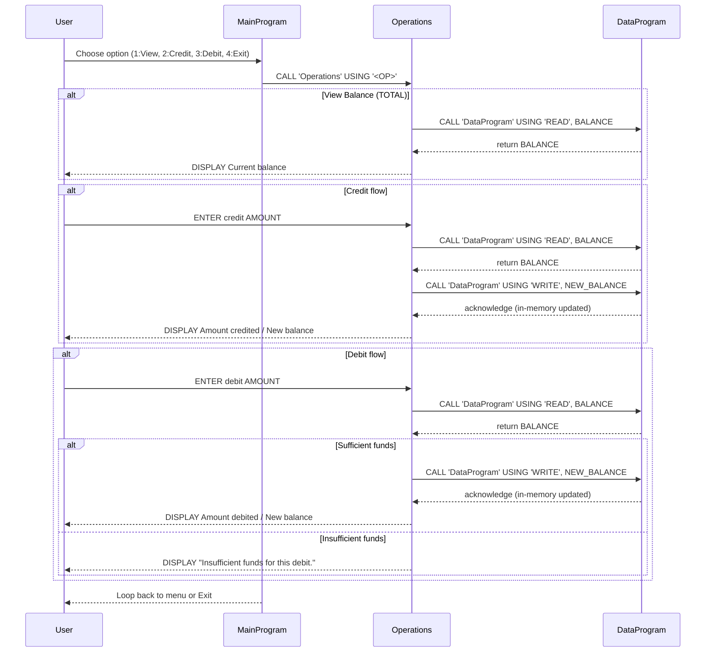

# COBOL Student Account Programs

## Overview
This small COBOL suite implements a simple student account management console application. It provides a menu-driven interface to view an account balance, credit (deposit) funds, and debit (withdraw) funds.

## Files
- [src/cobol/data.cob](src/cobol/data.cob): Implements `DataProgram`, the in-memory storage handler for the account balance. It exposes a simple READ/WRITE interface via `CALL ... USING` to share the current balance with other programs.
- [src/cobol/operations.cob](src/cobol/operations.cob): Implements `Operations`, which handles the application operations: `TOTAL` (view balance), `CREDIT` (accept credit amount, update balance), and `DEBIT` (accept debit amount, update balance if funds available).
- [src/cobol/main.cob](src/cobol/main.cob): Implements `MainProgram`, the interactive menu loop that accepts user choices and dispatches to `Operations`.

## Key Routines and Responsibilities
- `DataProgram` (in `data.cob`)
  - Purpose: Maintain a single in-memory storage field `STORAGE-BALANCE` (default 1000.00).
  - Interface: `PROCEDURE DIVISION USING PASSED-OPERATION BALANCE` where `PASSED-OPERATION` is `'READ'` or `'WRITE'` (6-char PIC X(6)), and `BALANCE` is a numeric linkage parameter.
  - Behavior: On `'READ'` it moves `STORAGE-BALANCE` to the caller; on `'WRITE'` it updates `STORAGE-BALANCE` from the caller.

- `Operations` (in `operations.cob`)
  - Handles operation codes passed from `MainProgram` via linkage.
  - `TOTAL` — Calls `DataProgram` using `'READ'` and displays the current balance.
  - `CREDIT` — Prompts for an amount (`ACCEPT AMOUNT`), reads current balance, adds the amount, writes the new balance back, and displays the result.
  - `DEBIT` — Prompts for an amount, reads current balance, checks `IF FINAL-BALANCE >= AMOUNT`, and if sufficient subtracts, writes back, and displays the result; otherwise displays an insufficient funds message.

- `MainProgram` (in `main.cob`)
  - Menu-driven loop (View Balance, Credit, Debit, Exit) using `EVALUATE` and `CALL 'Operations' USING '<OP>'` with padded 6-character operation codes (e.g., `'TOTAL '`, `'DEBIT '`, `'CREDIT'`).

## Business Rules (student accounts)
- Initial balance: accounts start with a default `STORAGE-BALANCE` value of `1000.00` (declared in `data.cob`).
- Debit rule: a debit is allowed only if the current balance is greater than or equal to the requested debit amount. If not, the system reports "Insufficient funds for this debit." No overdrafts are performed.
- Amount format and limits: monetary values are stored in `PIC 9(6)V99` (numeric with two decimals). This implies a maximum representable amount of 999,999.99 and up to two decimal places.
- Operation codes: operations are passed as fixed 6-character strings (PIC X(6)). Some codes include trailing spaces to fill the width (e.g., `'TOTAL '` and `'DEBIT '`). Keep the padding when calling.
- Persistence: the current implementation stores the balance in working-storage only, so balances are not persisted across program runs. `DataProgram` acts as an in-memory module rather than a persistent database layer.

## Notes & Maintenance Suggestions
- Input validation is minimal (user `ACCEPT` values are not validated). Consider adding numeric validation and handling non-numeric input.
- Consider persisting balances to a file or database if account state must survive restarts.
- Consider unifying operation-code handling to remove dependence on fixed-width padding (or document exact codes carefully).

---
Generated to summarize the COBOL sources and business rules for student accounts.

## Sequence Diagram

